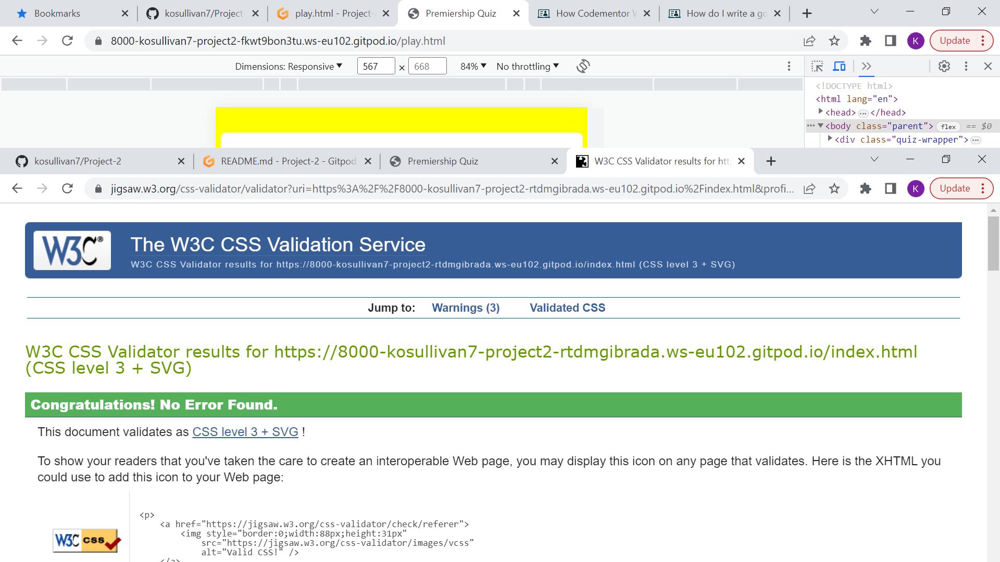

**Premiership Quiz** is an interactive website designed for English premiership football fans of all ages. 

-   [Introduction](#introduction)
-   User Experience (UX)
    -   Target Audience
    -   Strategy
    -   Scope
        -   User Stories
    -   Structure
    -   Surface
-   [Features](#features)
    -   Existing Features
    -   Future Features
-   [Languages-Used](#languages-used)
-   [Technologies-Used](#technologies-used)
-   [Testing](#testing)
    -   Validator Testing
    -   Responsiveness
    -   User Stories Testing
    -   Manual Testing
    -   Bugs
    -   Unfixed Bugs
-   [Deployment](#deployment)
-   [Credits](#credits)
    -   Content
    -   Code

# Introduction

The Premieship quiz is a fun interactive quiz for people who are fans of English premiership football. Users answer multiple choice questions and are rated on their final score.

Goal

The goal is to create an entertaining web-based football trivia quiz. I picked football because it is a sport I keenly follow myself. It will appeal to a range of age groups.

**User Experience (UX)**

**Target Audience**

The quiz targets people of all ages who enjoy quizzes and are specifically interested in English premiership football.

**Strategy**

The purpose of this online quiz is to provide an entertaining online quiz for people of all ages who like English Premier League football.

The quiz should be easy for the user to navigate and return to the home page or restart the quiz.

The application should initially be a simple design with enough interactivity to function and entertain. Questions can easily be added as popularity grows.

**Scope**

The project scope follows the minimal viable features approach for the initial project. However the scope is such that interactive features to enhance the user experience will be added in future.

The project is to be a simple functioning online quiz game with multiple choice questions. The score will accumulate up to a specified maximum. Initially this will be set to five as the test pool of questions is relatively small but sufficient for the user to enjoy the experience.

The purpose of the site will be clear from the landing page and will be visually attractive to the user. The site will be easy to navigate.

**User Stories**

As the site owner I want to:

-   create an entertaining interactive quiz on the topic of premiership football.

As a general user I want to:

1.  play a fun quiz
2.  navigate easily around the application
3.  clearly see what question number I am on
4.  answer reasonably challenging questions on the topic
5.  see immediately if my answer is right or wrong
6.  clearly see my accumulating score
7.  view my final score
8.  easily restart the game after I finish
9.  be rated on my knowledge of the subject

As a new user I want to

-   easily identify what the quiz topic is.

**Structure**

The user experience design is clear and simple with features positioned conventionally. Navigation items are clearly visible on each page signalling the pathway through the site from the home page through to the rules page and actual quiz page.

[Home Page]

-   There is a clear call to action button to start the quiz.
- There is also a link to a rules page which easily explains how to play the game.

[Rules Page]

- The rules of the quiz are clearly stated in bullet form for quick perusal. 
- Below the rules are navigation buttons to the Home page and Play the quiz page.

[Quiz Page]

-   The question is clearly visible in the middle of the quiz play area with the four answer choices underneath.
-   Below the question and answer section is the counter section showing the accumulating number of correct answers and the current question number out of the maximum available questions.
-   When the user selects the answer the colour of the answer changes to red or green to indicate correct or incorrect before displaying the next question.
- The user cannot move onto the next question without answering the current question.
- Below the score there are links to the landing page and also a Play again button.
- On pressing the Play again button the quiz will refresh with a new random order of questions.

**Surface**

-   Colours

    Contrasting, bright colours were used to make the app more visually appealing. The Home and Rules page have a background colour of yellow. The container has a background colour of dark green with a brown border to stand out. The links buttons are in white to add more contrast. 
    
    A background colour of yellow with the quiz area container white. The options buttons for quiz answers had a background colour of grey. The navigation buttons and question area are a teal colour.  The score are was a darker green. 

-   Font Colour

The font colour used in the home and rule pages is black apart from the links buttons which are white. All font on the quiz page is white in order to be more legible.

-   Font

The font selected was Segoe UI as it has a simple, clear look to the user and easily legible.

# Features

**Existing Features**

Quiz page

On the quiz page there is a 'Score Counter' to show the user's current score as they progress through the quiz:

There is also a 'Question number' indicator beside the question to show the user which question they are currently answering. The score area also shows how many questions there are in total.

When the user selects an answer by clicking the answer turns either red for incorrect or green for correct and remains coloured until a new question i

The mouse changes to a pointer on all the clickable buttons and answer option to indicate clearly where the user can click for an action.

**Future Features**

Future features to add to improve the user interface would be:

-   In order to add features first the question pool would have to be increased and a function added to ensure that questions were not repeated within the play period of the user.
-   The ability to save the user name and high scores so the user could return to the quiz to beat their own scores.
-   Currently the questions are all text-based but expanding to include visual questions with pictures would increase enjoyment for the user.
-   An audio sound on completion of the game would also enhance user experience.
-   Given sufficient questions, a list of questions answered correctly and incorrectly could be generated at the end of the quiz.
-   Images of footballers with football icons could be used.
-   A navigation option would be added to the home page along with the future features above to enable the user to directly access their high scores and for a new user to view a rules/instructions page

# Languages Used

-   HTML (Hypertext Markup Language) was used to design the basic website.
-   CSS (Cascading Style Sheets) to style the website and make it look more appealing to the user.
-   JavaScript was used to provide interactivity to the application.

# Technologies Used

Gitpod was used for the IDE

HTML Validator

CSS Validator

# Testing

Validator Testing

HTML Validator was run at several points during the project and small syntax errors were identified and fixed. At the final stage no errors or warnings were found.

CSS Validator was run several times during the project and picked up small syntax errors which were corrected. At the time of submission the css code successfully passed the validator with no errors detected.

Lighthouse in Chrome Developer Tools was used to check performance and scored well overall.

**Responsiveness**

The website was tested primarily on Chrome through the design phase. Additional testing was conducted on Mozilla, Edge and Safari browsers with good performance.

# Deployment

The site was deployed to GitHub pages. The steps taken to deploy are as follows:

1.  Log in to [GitHub](https://github.com/)
2.  Navigate to [kosullivan7/Project-2](https://github.com/kosullivan7/Project-2) in the list of repositories
3.  In the GitHub repository, navigate to the Settings tab
4.  In Settings scroll down to [GitHub pages](https://github.com/kosullivan7/Project-2/settings/pages) which opens in a new page.
5.  From the source section drop-down menu, select the Master Branch
6.  Once the master branch has been selected, the page is automatically refreshed and a display indicates the successful deployment and the link to the address. The link to the live website is here: [Project-2](https://kosullivan7.github.io/Project-2/)

# Credits

**Content**

Questions were derived mainly from the below website:

-   [Goal](https://www.goal.com/en)

**Code**

-   This tutorial [simplestepcode](https://simplestepscode.com/javascript-quiz-tutorial/) was followed closely for the basic javascript set up of question and answers generation. This was a good tutorial outlining the steps involved.

The following were used as references to check syntax for coding and also for general theory and its application:

-   [w3 schools](https://www.w3schools.com/)
